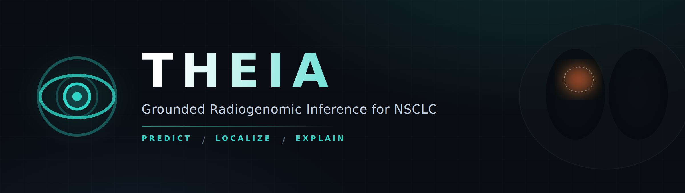

<div align="center">



<br>

**Non-invasive molecular profiling for NSCLC: predict actionable mutations from CT and pathology, localize the evidence, explain the call, and know when to defer to biopsy.**

One multi-modal vision-language model that classifies, grounds, and generates, validated across institutions.

<br>


</div>

---

## Contents

- [What THEIA does](#what-theia-does)
- [Why it is novel](#why-it-is-novel)
- [How it works](#how-it-works)
- [Repository layout](#repository-layout)
- [Quickstart](#quickstart)
- [The pipeline, step by step](#the-pipeline-step-by-step)
- [Configuration](#configuration)
- [Data](#data)
- [The 12-month program](#the-12-month-program)
- [Reader study](#reader-study)
- [Interactive demo](#interactive-demo)
- [Citation](#citation)
- [License](#license)

---

## What THEIA does

THEIA takes lung imaging (CT, and H&E pathology in the multi-modal build) and returns four things in one forward pass:

| Output | Head | What you get |
|--------|------|--------------|
| **Prediction** | classifier | actionable mutation panel (EGFR, KRAS, and more), with calibrated confidence |
| **Localization** | grounding | attention maps that point at the sub-regions behind the call, in either modality |
| **Explanation** | generation | a short, structured rationale a clinician can audit |
| **Deferral** | uncertainty | an honest "defer to biopsy" when the imaging call is not confident enough |

The name is the Greek titaness of sight and light: the model *sees* (vision) and *illuminates* what it saw (grounding). That linkage between a prediction, the pixels behind it, and a written rationale is the whole point.

> **Scope note.** This repo is the CT-only core (classify + ground + generate on a single cohort), which is phase one of a 12-month program. The multi-modal branch (pathology, multi-gene, cross-institution external validation, uncertainty-aware deferral, and a radiogenomic discovery atlas) is the larger build. See [`docs/PROJECT_PLAN.md`](docs/PROJECT_PLAN.md) for the full plan.

---

## Why it is novel

As of mid-2026 the two closest published models each stop several steps short:

| Model | Classify | Generate | Ground | Multi-modal | External val | Discovery |
|-------|:--------:|:--------:|:------:|:-----------:|:------------:|:---------:|
| Glio-LLaMA-Vision (npj Digital Medicine, 2026) | yes | yes | **no** | no | yes | no |
| NEVA (Nature Communications, 2026) | yes | **no** | yes | no | partial | no |
| **THEIA** | **yes** | **yes** | **yes** | **yes (CT + path)** | **yes** | **yes** |

Nobody has put classification, generation, and grounding in one model, nobody has done grounding for radiology-modality biomarker prediction, and nobody has combined CT and pathology into a single externally-validated system that also surfaces reproducible imaging-to-genotype associations. Frame the paper around that combination and the discovery output, not the general "VLM for radiogenomics" claim, which has a short shelf life.

---

## How it works

```
                       ┌────────────────────────────────┐
  CT ROI stack ───────▶│  Vision encoder (BiomedCLIP ViT)│──▶ patch tokens [B, N, D]
  [B, S, 1, H, W]      └────────────────────────────────┘             │
                                                                       ▼
                                             ┌──────────────────────────────────┐
                                             │  Grounding head                    │
                                             │  Q region queries cross-attend     │
                                             │  over the patch tokens             │
                                             └──────────────────────────────────┘
                                     region_emb [B, Q, D]  │   attn_maps [B, Q, H', W']
                            ┌──────────────────────────────┘             │
                            ▼                                            ▼
                 ┌──────────────────────┐                     supervised against the
                 │  Classifier head      │                    tumor ROI mask (Dice + BCE)
                 │  EGFR / KRAS logits    │                    so attention is anchored
                 └──────────────────────┘                     to real anatomy
                            │  pool region_emb                            │
                            ▼                                            ▼
                EGFR / KRAS + confidence            ┌────────────────────────────────┐
                                                    │  Generation head (LoRA LM)      │
                                    region_emb ────▶│  visual prefix -> rationale     │
                                                    └────────────────────────────────┘
```

The classifier pools from the **grounded** region embeddings, not a separate global token, so the prediction and the localization share one representation.

How tight that coupling actually is depends on `model.region_pooling`. The grounding loss supervises the element-wise **max** over the Q region queries, so only `region_pooling: max` makes the classifier consume exactly what grounding supervises. Under the default `mean`, a query that attends off-tumor still feeds the prediction and is never penalised, as long as some other query covers the tumor. Say which one you used.

Loss is a weighted sum:

```
L  =  w_cls · CrossEntropy(EGFR, KRAS)
   +  w_gen · LM_loss(rationale)
   +  w_ground · [Dice + BCE](attention_union, tumor_ROI)
```

Unknown labels are masked out. The grounding term is what makes the attention maps trustworthy instead of decorative.

---

## Repository layout

```
THEIA/
├─ assets/banner.png            this banner
├─ configs/default.yaml         every hyperparameter and path, one file
├─ theia/
│  ├─ config.py                 typed YAML loader with dotted overrides
│  ├─ data/
│  │  ├─ download.py            TCIA fetch helper + integrity checks
│  │  ├─ preprocess.py          DICOM -> ROI arrays, pseudo-report build
│  │  └─ dataset.py             torch Dataset + patient-level k-fold
│  ├─ models/
│  │  ├─ backbone.py            vision encoder (BiomedCLIP / timm ViT)
│  │  ├─ heads.py               classifier, grounding, generation heads
│  │  └─ theia_model.py         the three-head model, joint forward
│  ├─ engine/
│  │  ├─ losses.py              classification + generation + grounding loss
│  │  ├─ train.py               k-fold LoRA fine-tune loop
│  │  └─ evaluate.py            AUC + CIs, grounding IoU, rationale scoring
│  └─ reader_study/
│     ├─ build_cases.py         build blinded, randomized presentations
│     └─ serve.py               Flask app for clinicians to score cases
├─ scripts/                     thin shell entrypoints
├─ tests/                       smoke tests (no data or GPU required)
├─ demo/index.html              interactive front-end demo (mock data)
└─ docs/
   ├─ ARCHITECTURE.md           deeper design notes + week-by-week mapping
   └─ PROJECT_PLAN.md           the full 4-month research plan
```

---

## Quickstart

**Requirements:** Python 3.10+, one CUDA GPU with 24 GB or more for training. Apple Silicon (MPS) runs the CT-only build but is slow and memory-tight — the shipped `batch_size: 8` at `n_slices: 16` is 128 images per step and will drive a 24 GB machine into swap; drop to 2 and raise `grad_accum`. CPU is fine for the tests. The device is chosen automatically (cuda > mps > cpu) and printed at startup along with whether AMP is really on; override with `--device` or `train.device`.

```bash
git clone https://github.com/sathvikloke/THEIA.git
cd THEIA
bash scripts/setup.sh
```

Verify the wiring before you touch any data:

```bash
pytest -q
```

Then the three stages:

```bash
bash scripts/run_preprocess.sh     # download + build the dataset
bash scripts/run_train.sh          # k-fold LoRA fine-tune
bash scripts/run_eval.sh           # metrics + build reader-study cases
```

> **Before anything else, confirm GPU access.** It is the single biggest risk to the timeline, not the modeling.

---

## The pipeline, step by step

**1. Download** (`theia/data/download.py`)
Pulls the NSCLC-RADIOGENOMICS series manifest and DICOM images from TCIA. You need a registered TCIA account and, for the API, a token in a `.env` file. Clinical labels and semantic annotations ship as supplementary spreadsheets on the collection page and are dropped into `data/raw/.../clinical/` by hand once.

**2. Preprocess** (`theia/data/preprocess.py`)
For each patient: load the CT and the tumor segmentation, resample the mask onto the CT grid, apply a lung window, take the slices spanning the tumor, crop a margin-dilated ROI, and render the controlled-vocabulary semantic annotation as a one-sentence pseudo-report. Writes one `.npz` per patient plus a `rows.jsonl` index. The pseudo-report is the supervision signal for the generation head, so you never hand-write reports.

**3. Train** (`theia/engine/train.py`)
Patient-level stratified k-fold. Each fold trains the three-head model with LoRA on the language model, AMP, one-cycle schedule, and early stopping on validation EGFR AUC. Checkpoints and per-epoch metrics land in `checkpoints/foldN/`.

**4. Evaluate** (`theia/engine/evaluate.py`)
ROC-AUC per gene with bootstrap confidence intervals, sensitivity and specificity, and three grounding measures — attention mass inside the ROI, a pointing game, and an area-matched IoU.

**Read the grounding numbers against their baselines.** Every grounding metric ships beside a `*_shuffled` twin: the same statistic computed on a spatially permuted copy of the model's own attention. That is the chance level for *your* crop geometry, and it rises as the tumor fills more of the frame. `grounding_*_lift` is the gap, and the gap is the result — a raw IoU of 0.74 means nothing if shuffling scores 0.73. Report the lift, not the bare number. (The earlier fixed-threshold IoU could not tell trained attention from random noise; see `tests/test_regressions.py::test_grounding_metric_separates_signal_from_noise`.)

Note: BLEU and ROUGE on the rationale are a sanity check only. The real rationale evaluation is the reader study, because text-overlap metrics do not measure clinical correctness.

**5. Reader study** (`theia/reader_study/`)
`build_cases.py` produces blinded, randomized presentations across three arms (full THEIA output, prediction only, and ground truth). `serve.py` is a small Flask app where clinicians score plausibility, grounding, and usefulness. Arm identity stays in a held-back key file until scoring is done.

---

## Cohort reality (measured, NSCLC-RADIOGENOMICS)

Counts pulled from the TCIA API and the clinical spreadsheet, not estimated:

| | patients | EGFR +/− | KRAS +/− |
|---|---|---|---|
| has CT | 211 | 43 / 129 | 38 / 133 |
| **has CT + SEG** (grounding supervised) | **144** | 23 / 94 | 27 / 88 |
| **has CT + (SEG or AIM)** — what THEIA uses | **191** | **41 / 118** | 34 / 124 |

Only 144 of 211 subjects have a segmentation, but 190 have an AIM annotation
carrying a lesion centroid. Including the AIM-only tier takes EGFR positives from
23 to 41. Those patients get a fixed-size crop centred on the annotated lesion,
their ROI is written as zeros, and the grounding term skips them — no mask is
invented. See `data.aim_crop_mm`.

**ALK has 2 positives.** It cannot be modelled. Config validation will not stop
you, because 2 is a legal number.

### Current measured result

| run | cohort | encoder | crops | pooled EGFR AUC |
|---|---|---|---|---|
| 1 | 117 pt, 23 pos | fine-tuned | centred | 0.426 [0.307, 0.546] |
| 2 | 153 pt, 40 pos | frozen | centred | 0.573 [0.470, 0.676] |
| **3** | **153 pt, 40 pos** | **last-2 unfrozen** | **jittered** | **0.654 [0.558, 0.751]** |

Run 3 is the first whose interval excludes chance. KRAS remains at chance
(0.522 [0.400, 0.639]), consistent with its flat learning curve — keep it
exploratory.

Grounding now works but is **unstable across folds**: mean mass lift +0.061
against a 0.039 chance baseline, ranging 0.000 to 0.217, with pointing above
0.9 in three of five folds and 0.00 in one. It went from provably impossible
(a centred crop has no localisation task) to intermittently good. Do not report
it as solved.

**Report the pooled out-of-fold AUC, not the mean of per-fold AUCs.** With ~23
positives across 5 folds, a single held-out fold holds ~5, and an AUC from 5
positives has a 95% CI near ±0.27 even when the model is genuinely good — an
interval that includes chance. Pooling every fold's out-of-fold prediction into
one ranking gives ±0.12 at the same sample size. `train.py` prints the pooled
figure as the headline and rank-normalises within fold first, because each fold
is a different model and their probability scales are not comparable.

## Known limitations

State these before a reviewer does.

**The rationale does not explain the mutation call.** The generation head is supervised on the AIM semantic annotations — margin, attenuation, shape, location, associated findings. Those are radiologists describing the *image*. Nothing in that supervision signal carries genomic reasoning, so the head learns to caption a nodule, not to justify an EGFR prediction. Calling the output "a rationale a clinician can audit" overstates what it is. Fixing this properly means a supervision signal that ties imaging evidence to the molecular call, and that is a design problem, not a code change.

**You must unzip the AIM archive to `data/raw/<cohort>/aim/`.** `build_pseudo_report` reads six columns (`Surface`, `Density`, `Location`, `SizeCategory`, `PleuralAttachment`, `VascularConvergence`) that **do not exist** in the TCIA clinical spreadsheet — that file holds demographics, staging, treatment and outcome. Without the AIM files every patient falls through to identical defaults, the generation head trains on ~190 copies of one sentence, converges to a constant, and reports an excellent loss. `preprocess` now counts distinct rationales and warns, but the archive is the fix.

**Grounding is measured on a tumor-centred crop.** At `context_factor: 1.0` the lesion fills most of the frame, so the chance baseline for every localization metric is high and the achievable lift is compressed. The `*_shuffled` columns make this visible rather than hidden. Raising `context_factor` to 2.0–3.0 makes grounding a real task at the cost of a smaller lesion in the input; it changes the science, so decide deliberately.

**Statistical power.** NSCLC-RADIOGENOMICS is ~211 patients and EGFR-mutant prevalence in Western NSCLC cohorts is well under a third. Pull the actual positive counts from the clinical sheet before building on them — `evaluate` reports `<gene>_n` and `<gene>_n_pos` per fold for exactly this reason. Bootstrap CIs on an AUC computed from single-digit positives will be wide enough to be uninformative, and that belongs in the paper.

**Every reported metric comes from the epoch your monitor picked.** `train.monitor` selects the checkpoint. Monitoring `egfr_auc` and then reporting grounding means the grounding number is from whichever epoch won on AUC, which may be before grounding converged at all.

## Configuration

Everything lives in `configs/default.yaml`. Override any key from the command line without editing the file:

```bash
python -m theia.engine.train --config configs/default.yaml
```

Ablations that the paper needs are one-line config changes, not code changes:

| Ablation | Change |
|----------|--------|
| Grounding off (isolate its effect) | `train.loss_weights.ground: 0` |
| Classification only (match radiomics baselines) | `train.loss_weights.gen: 0` |
| Pretrain grounding on RadGenome-Chest CT | `grounding_pretrain.enabled: true` |
| Swap the vision encoder | `model.vision_encoder: timm_vit_b16` |

---

## Data

Multi-cohort by design. Internal cohorts are pooled and k-folded; the external cohort stays sealed until the model is frozen.

| Cohort | Role | Modalities | Notes |
|--------|------|-----------|-------|
| [NSCLC-RADIOGENOMICS](https://www.cancerimagingarchive.net/collection/nsclc-radiogenomics/) (TCIA) | train / internal | CT, PET | 211 patients, semantic annotations for generation supervision |
| TCGA-LUAD | train / internal | CT, H&E WSI | matched mutation calls, main pathology source |
| TCGA-LUSC | train / internal | CT, H&E WSI | squamous complement |
| NSCLC-Radiomics | train / internal | CT | additional CT volume |
| Collaborator / private cohort | **external test (sealed)** | CT (+ path) | never trained on, the generalization result rides on this |
| [RadGenome-Chest CT](https://www.nature.com/articles/s41597-025-05922-9) | grounding pretraining | CT | 665K grounded reports, no genomic labels |

Harmonize mutation-call formats across cohorts early, and keep splits patient-level so nothing leaks.

---

## The 12-month program

THEIA is a year-long build with quarterly checkpoints, each producing a standalone result so the project is de-risked at every stage. The short version:

| Quarter | Focus | Checkpoint |
|---------|-------|-----------|
| Q1 | Harmonize cohorts, reproduce the CT-only grounded baseline (this repo) | working internal baseline |
| Q2 | Add the pathology branch and multi-modal fusion (modality dropout) | multi-modal beats single-modality internally |
| Q3 | External validation, uncertainty and deferral, the discovery atlas | generalization result + deferral curve |
| Q4 | Multi-reader blinded study, ablations, writeup, submission | preprint + submission |

The full plan, including the data harmonization, the pathology backbone choice, the "biopsies safely avoided" analysis, risks, and target venues, is in [`docs/PROJECT_PLAN.md`](docs/PROJECT_PLAN.md). The single biggest lever for a top-tier acceptance is the external validation on the sealed collaborator cohort, which is why it is planned from day one, not bolted on at the end.

---

## Reader study

The reader study is the actual clinical validation, and the reason THEIA is more than a benchmark number. Clinicians see de-identified, blinded presentations and never learn which arm they are scoring. To run it after training:

```bash
python -m theia.reader_study.build_cases --ckpt checkpoints/fold0/best.pt
python -m theia.reader_study.serve --reader R1
```

Confirm with your IRB office early whether a study on public, de-identified data with no new patient contact needs a determination. Get it in writing. Do not leave it to the week you want to run the study.

---

## Interactive demo

`demo/index.html` is a self-contained front end (open it in any browser) that shows the intended experience on mock data: flip between cases, and hover any clause in the rationale to light up its region on the scan, and the reverse. It is the same layout the reader study adapts. No data or model required to view it.

---

## Citation

If this work is useful, please cite the repository and the underlying datasets per their data-use terms (TCIA NSCLC-RADIOGENOMICS, RadGenome-Chest CT, and any TCGA cohorts).

```bibtex
@software{theia2026,
  title  = {THEIA: Grounded Radiogenomic Inference for NSCLC},
  author = {Loke, Sathvik and collaborators},
  year   = {2026},
  url    = {https://github.com/sathvikloke/THEIA}
}
```

---

## License

MIT, code only. The datasets carry their own terms. See [LICENSE](LICENSE).

<div align="center"><br><sub>THEIA is a research prototype. It is not a medical device and must not be used for clinical decisions.</sub></div>
