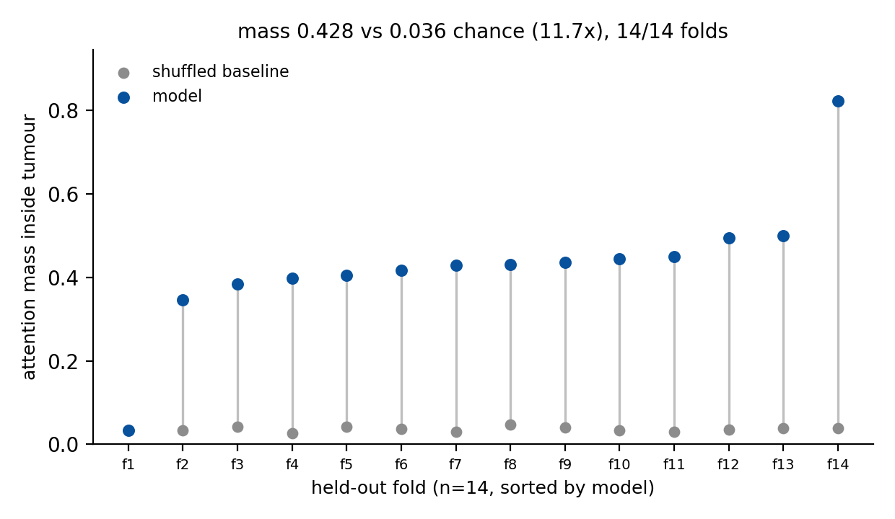
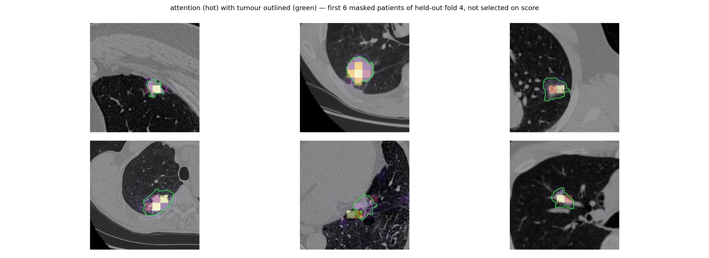

# THEIA — results of record

What is measured, what it means, and which numbers are safe to quote. Written
because the project's framing changed materially and the evidence for that
change was scattered across commit messages, logs and a temp directory.

Cohort throughout: NSCLC-Radiogenomics, 158 preprocessed patients, 153 with a
known EGFR call, 40 of them mutant (26%). All estimates are pooled out-of-fold
over 5 nested folds, with within-fold rank normalisation, and bootstrap CIs.

---

## 1. The headline, and the number that undercuts it

| model | EGFR AUC | 95% CI |
|---|---|---|
| smoking status alone | **0.794** | [0.695, 0.882] |
| clinical (age, sex, ethnicity, smoking, pack-years) | 0.764–0.774 | [0.665, 0.859] |
| clinical + radiomics | 0.783 | [0.690, 0.869] |
| **THEIA, 3 seeds** | **0.617 ± 0.024** | range [0.597, 0.643] |
| THEIA + peritumoral branch, 3 seeds † | 0.675 ± 0.017 | range [0.656, 0.689] |
| radiomics | 0.526–0.662 | see §3 |

**The multi-seed estimate is the one to quote, and it is lower than any single
run suggested.** Per seed, with `gen = 0` (the measured-stable setting), every
seed now on the full cohort:

| seed | EGFR AUC | 95% CI | n | stalled folds |
|---|---|---|---|---|
| 1337 | 0.643 | [0.534, 0.746] | 153 | 0 |
| 7 | 0.612 | [0.497, 0.716] | 153 | 0 |
| 42 | 0.597 | [0.482, 0.709] | 153 | 0 |

All three individual CIs include chance.

This table previously read 0.627 ± 0.041, with seed 1337 at 0.674 on 122
patients because one of its folds stalled. That run was **retrained rather than
analysed around** (`base-s1337-rerun`), and the complete version scores 0.643 on
all 153. The headline therefore moves down slightly and the seed spread nearly
halves. The old caveat — "the best-looking seed is the least complete one" — is
now resolved rather than merely disclosed.

**An earlier single run gave 0.660 [0.556, 0.758] with the CI excluding chance**
(run 12, generation term active). That number is real but it is one draw from a
distribution with sd 0.024–0.041; quoting it alone overstates both the effect and
the precision.

THEIA is **beaten by a single chart variable** either way.

### † The peritumoral branch is suggestive, not established

Feeding the classifier the ring around the lesion as well as the grounded region
moves the pooled AUC from 0.617 to 0.675, improving in 3/3 seeds. It is kept, and
it is deliberately not claimed as a result.

It was first found on frozen features, where a sweep over 10 poolings gave the
peritumoral ring 0.695 against 0.632 for the whole crop, with a size- and
shape-matched ring at a **random location** scoring 0.575 — so the gain is
location-specific rather than an artefact of pooling a thin annulus. That part
holds.

What does not hold is the significance this repository previously claimed for it
(+0.075, 10/10 seeds, p = 0.002). That p came from a sign test across seeds, and
ten seeds are ten re-splits of **one** 153-patient cohort — split variance, not
sampling variance. Re-run as a paired bootstrap over patients, with Holm
correction across the 10 arms the sweep scores on the same folds:

| arm | Δ vs whole-crop | 95% CI | p raw | **p Holm** |
|---|---|---|---|---|
| peritumoral (2-ring) | +0.066 | [+0.007, +0.130] | 0.031 | **0.281** |
| peritumoral (1-ring) | +0.064 | [−0.005, +0.137] | 0.077 | **0.614** |
| tumour + peritumoral | +0.042 | [−0.027, +0.113] | 0.246 | 1.000 |
| CONTROL shifted-ring | −0.059 | [−0.131, +0.009] | 0.092 | 0.641 |

**Nothing in the sweep survives correction.** End-to-end the branch is worth
+0.058 (95% CI [−0.008, +0.128], p = 0.086). Direction consistent, controls
clean, significance absent — which is the honest summary and is how it is
reported.

Independently, this is a **replication rather than a discovery**: peritumoral
radiomics for EGFR has been reported at least six times since 2022, with optimal
ring widths of 1, 2, 3, 4, 6 and 15 mm ([REFERENCES.md](REFERENCES.md) §6–11).

### The headline is softer still on the subset that should carry it

Every EGFR-mutant patient in this collection is an adenocarcinoma. The 35
squamous and 4 NSCLC-NOS patients are wild-type **without exception**, so 20
patients — 13% of the labelled cohort — are correctly classifiable from histology
alone, with no imaging. `MODEL_CARD.md` already declares non-adenocarcinoma out
of scope, so the analysis cohort and the stated scope disagreed; this is what
reconciling them costs:

| subset | n | pos | EGFR AUC |
|---|---|---|---|
| full cohort | 153 | 40 | 0.617 ± 0.024 |
| adenocarcinoma only | 133 | 40 | 0.602 ± 0.031 |
| segmented only | 117 | 23 | 0.579 ± 0.026 |
| **segmented adenocarcinoma** | **97** | **23** | **0.563 ± 0.032** |

(Computed from the archived per-patient probabilities of the canonical runs,
with ranks recomputed within each subset — a rank is a statement about the
patients being compared, so inheriting full-cohort ranks would import information
about the patients just excluded.) The analysis plan now makes segmented
adenocarcinoma the primary analysis set.

### And the probabilities are worse than a constant

AUC is invariant to any monotone transform of the scores, so it says nothing
about whether the numbers the model emits are *probabilities*. CLAIM asks for
calibration separately for that reason. Computed from the archived per-patient
softmax outputs, with no retraining:

| run | slope | intercept | Brier | reliability | resolution | O:E |
|---|---|---|---|---|---|---|
| base-s1337-rerun | 0.302 | −0.211 | 0.217 | 0.041 | 0.017 | 0.89 |
| ms-s7 | 0.123 | 0.750 | 0.246 | 0.068 | 0.017 | 1.27 |
| ms-s42 | 0.115 | −0.373 | 0.248 | 0.064 | 0.009 | 0.86 |
| **mean** | **0.180** | 0.056 | **0.237** | | | |

A calibration slope of 1.0 is perfect. **0.180 means the predictions are roughly
five times too extreme.**

Worse, the base rate is 26.1%, so a model that ignores the image and predicts
0.261 for every patient scores a Brier of `0.261 × 0.739 = 0.193`. THEIA scores
0.217–0.248. **All three runs, on both the full cohort and the primary analysis
set, are worse than that constant.** Resolution — the component only a better
model can improve — is 0.009–0.017.

So the honest summary of the classification arm is: it ranks slightly better than
chance (AUC 0.617) while emitting probabilities that are actively misleading. The
two statements are compatible and both belong in the paper.

Two consequences already written into [ANALYSIS_PLAN.md](ANALYSIS_PLAN.md):
no operating point is pre-specified (a threshold on these probabilities would be
indefensible), and the sealed external-validation artifact must carry Platt or
isotonic recalibration fitted on the inner validation split.

In this cohort never-smokers are 60.6% EGFR-mutant against 8.3% (current) and
18.8% (former); OR 7.69, Fisher exact p = 1.7e-6. This is the textbook
epidemiology, not an artefact.

## 2. The question that decides the paper

Imaging is only interesting if it adds something a clinician does not already
have. Repeated **per seed**, with the clinical baseline rebuilt on each seed's
own folds — `cfg.seed` drives `nested_kfold_indices`, so reusing one baseline
across seeds would pair each patient against a model that held out a different
set entirely — and compared by paired bootstrap:

| seed | clinical | + THEIA | ΔAUC | 95% CI | p |
|---|---|---|---|---|---|
| 1337 | 0.764 | 0.752 | −0.012 | [−0.068, +0.044] | 0.677 |
| 42 | 0.779 | 0.736 | −0.044 | [−0.107, +0.021] | 0.175 |
| 7 | 0.805 | 0.776 | −0.029 | [−0.093, +0.038] | 0.372 |

> **Δ = −0.028 ± 0.016 across seeds, and every seed's CI includes zero.**

All three seeds are now scored on the full 153 patients. The seed-1337 row
previously read +0.008 on 122 patients, from the run whose fold 1 stalled.

**THEIA adds nothing on top of five chart variables**, and the point estimate is
slightly negative in two of three seeds.

Deliberately *not* merged into one large paired test. A patient appears once per
seed, so the merged set has patients × seeds rows; the bootstrap resamples rows
and would treat three correlated copies of the same patient as three independent
observations, shrinking the interval by roughly √3 for no added information.

For reference, the single-run version of this test (run 12, generation term
active) gave −0.006 [−0.066, +0.048], p = 0.832. It agrees in direction, but it
inherited ±0.041 of seed noise without showing it; the per-seed table above is
the one to quote.

This does not say imaging is uninformative in principle — §2b shows the images
do carry signal. It says that on 158 patients, whatever EGFR signal this model
extracts is already carried by smoking status.

## 2b. The images do carry signal — and the architecture adds nothing to it

At n=153 the permutation tests are significant for the first time. Both were
null at n=117 (p = 0.52 deep, 0.94 radiomics):

| features | pooled OOF AUC | permutation p (200 shuffles) |
|---|---|---|
| frozen BiomedCLIP + L2 logistic regression | 0.683 | **0.010** |
| radiomics + L2 logistic regression | 0.680 | **0.010** |

So there is real EGFR signal in these images. That was an open question and it
is now answered.

The uncomfortable part is the comparison against the full model. Scored through
**exactly THEIA's nested splits**, per seed:

| seed | frozen probe | THEIA | diff |
|---|---|---|---|
| 1337 | 0.626 | 0.643 | −0.017 |
| 42 | 0.562 | 0.597 | −0.035 |
| 7 | 0.665 | 0.612 | +0.053 |
| **mean** | **0.617 ± 0.052** | **0.617 ± 0.024** | — |

A logistic regression on frozen features is statistically indistinguishable from
the whole grounded multimodal network — the two means are **identical to three
decimals**, and THEIA's advantage over its own frozen features is exactly nothing.

Read that with the sample size, though. Riley's minimum n for a 512-feature
prediction model is **4,707** and this cohort has 153, so "the probe matches the
model" is as much a statement about the cohort being too small to identify either
arm as it is about the architecture. Both readings are reported.

One protocol caution, because it nearly became a wrong headline. The same
features and estimator score **0.683 under `diagnostics.py`'s flat
StratifiedKFold** and **0.617 under the nested protocol** — 0.066 of difference
from the evaluation protocol alone, with no change to the model. Read against
the flat number the probe appears to beat THEIA outright; read against the
matched one it does not. Any comparison between arms has to hold the protocol
fixed, and that gap is larger than most effects reported in this literature.

Learning curves are still rising at the full cohort, and their spread is
collapsing, so more labelled data still helps:

| n train | frozen probe | radiomics |
|---|---|---|
| 38 | 0.484 ± 0.169 | 0.560 ± 0.126 |
| 76 | 0.627 ± 0.066 | 0.531 ± 0.097 |
| 115 | 0.654 ± 0.050 | 0.621 ± 0.050 |
| 153 | 0.665 ± 0.028 | 0.624 ± 0.029 |

## 2c. KRAS is at chance, measured properly

Reported here rather than dropped, because a gene that fails is evidence about
the method and a panel quietly narrowed to its best member is not a result.

| seed | KRAS AUC | 95% CI | n | positives |
|---|---|---|---|---|
| 1337 | 0.551 | [0.439, 0.668] | 122 | 23 |
| 42 | 0.483 | [0.362, 0.603] | 152 | 32 |
| 7 | 0.493 | [0.386, 0.603] | 152 | 32 |

**0.487 ± 0.005 across seeds**; every interval spans chance and the point
estimate is indistinguishable from 0.5. At 21% prevalence (32 of 152) the study
is underpowered for KRAS on its own, but nothing here suggests an effect being
missed rather than absent — unlike EGFR, whose permutation test is significant
at the same n.

This is consistent with the biology: KRAS mutation has no established
morphological correlate comparable to EGFR's association with ground-glass
opacity and never-smoker status. KRAS stays exploratory and is not a headline
endpoint.

## 3. Radiomics is dominated by analytic choices, not biology

Six pre-specifiable pipelines, same folds, same estimator family:

| feature bank | L2 | L1 | L1+L2 search |
|---|---|---|---|
| legacy, 18 features | 0.662 | 0.605 | 0.604 |
| rich, 61 features | 0.604 | 0.526 | 0.568 |
| clinical, 14 features | 0.774 | 0.773 | 0.764 |

Radiomics spans **0.136 AUC** across these choices; clinical spans **0.010**.
The spread on the radiomics arm is comparable to the entire effect size this
literature reports. Two independent attempts to strengthen it — more features,
then LASSO selection as the field does it — both made it worse.

Scope: six configurations, one cohort, n=153. This does **not** show published
radiomics results are wrong; cohorts differ (many are Asian cohorts with ~50%
EGFR prevalence against our 26%) and many use proper validation. It does show
that an estimate this sensitive to analytic choice needs nested validation
before it means anything.

## 4. Grounding — this part works

The localisation claim is the one that holds up, and in the final configuration
it holds up robustly. Across **14 scored folds** (3 seeds x 5 folds, one fold
stalled and excluded), on held-out patients:

| metric | model | shuffled baseline | lift |
|---|---|---|---|
| attention mass in ROI | **0.428 ± 0.154** | 0.036 ± 0.005 | **+0.391** |
| pointing game | **0.883 ± 0.248** | 0.049 ± 0.034 | **+0.835** |
| area-matched IoU | **0.637 ± 0.178** | 0.017 ± 0.008 | +0.620 |

Attention mass inside the tumour is **11.7x its shuffled baseline**, and mass
beats its own per-fold chance level in **14 of 14 folds** (sign test
p = 1.2e-4). By lift > 0.05, 13 of 14 folds localise. Mean peak ratio is 26.7,
so the maps are sharply peaked rather than diffuse — the failure mode that
produced an apparently-good pointing score in run 12 is absent here.

For scale, the tumour occupies 3.9% of the crop on average, so "attend to the
lesion" is not a free win: a uniform map scores ~0.039, which is exactly what
the shuffled baseline reports.

Each fold is joined to its **own** shuffled baseline rather than to a global
one, because chance depends on how much of the crop the tumour fills in that
fold. The single fold that fails sits on its baseline and is left visible.

Qualitative panels are easy to cherry-pick, so these are the first six masked
patients of the held-out fold in index order, not the best-scoring ones, and the
tumour contour is drawn from the ROI so the claim can be checked rather than
taken on trust.

Progress across configurations, which is mostly a record of bugs removed:

| run | grounding lift | folds localising | note |
|---|---|---|---|
| 6 | +0.235 | 4/5 | pre-clipping |
| 12 | +0.001 | 0/5 | the clamp fixed-point bug |
| 13 | +0.180 | 2/5 | 2 folds died in warmup |
| **multi-seed (final)** | **+0.391** | **13/14** | logit-BCE loss, warmup floor |

Two caveats that belong with the number. These runs set `loss_weights.gen = 0`,
so this is grounding alongside classification with the rationale head switched
off. And one fold (seed 42, fold 1) shows lift 0.000 at peak ratio 23.1 —
sharply peaked attention pointed somewhere other than the tumour, which is a
different failure from diffuse attention and worth understanding before the
claim is generalised.

## 4a. And it generalises — the primary endpoint, externally

The result above is one cohort. This is the same grounding heads, unchanged,
evaluated on **420 NSCLC-Radiomics patients** (Lung1, Maastro Clinic,
Netherlands): a different country, different scanners, and a radiotherapy-planning
population rather than a surgical one. 30 evaluations — 6 runs × 5 folds.

| metric | trained (all 30) | trained (25 live) | centre prior | shuffled | random-init head |
|---|---|---|---|---|---|
| attention mass in ROI | 0.346 | **0.407** | 0.269 | 0.049 | 0.049 |
| pointing game | 0.688 | **0.825** | 0.476 | 0.046 | 0.043 |
| area-matched IoU | 0.448 | **0.537** | 0.287 | 0.026 | 0.033 |

Mass lift **+0.297 ± 0.167**, beating the per-fold shuffle in **25 of 30**
evaluations. Against +0.391 internally, so it does decay — but it clears the
pre-specified +0.20 gate with room, on data the model has never seen.

**The centre prior is the control that matters**, and it is why this table has
five columns instead of three. These crops are lesion-centred: external ROI
centroids sit at (0.50, 0.51) of the frame with sd ≈ 0.08, covering 5.8% of the
area. A model that learned nothing except "look at the middle" scores **0.269**
on mass — most of the way to the trained model's 0.346. On mass alone the claim
would be thin. On pointing it is not: 0.688 against 0.476, and 0.825 among the
folds that localise at all. Pointing and area-matched IoU are provably invariant
to the prior's width (`tests/test_fov_and_subgroups.py`), so that margin cannot
be manufactured by choosing a flattering sigma.

The randomly-initialised head returns lift **+0.000** at peak ratio 1.01 — a
uniform map. Whatever the trained heads are doing, it is learned, not
architectural.

Five of 30 evaluations are dead: `ms-s42/fold1`, `run16-nogen-s1337/fold1`,
`peri-s42/fold2`, `peri-s7/fold4`, `peri-s1337/fold3`. All show pointing of
**exactly 0.000** at peak ratios of 9–24 — sharply peaked attention aimed
confidently somewhere other than the tumour. This is the same failure flagged in
§4 for seed 42 fold 1, and it reproduces externally, so it is a property of those
checkpoints rather than of the internal cohort. They are left in the pooled
numbers; the "25 live" column exists so the reader can see both.

Gate D, pre-specified in [ANALYSIS_PLAN.md](ANALYSIS_PLAN.md) §5, passes on all
four criteria: lift ≥ 0.20, beats shuffle in ≥ 71% of folds, random head ≈ 0, and
pointing above the centre prior.

## 4b. The rationale arm is not ready for a reader study

Blocking, and found only by building the case set and reading it.

**The generation head decodes BioGPT's prior, not the annotation.** Given a
patient whose annotation reads *"A spiculated round solid lesion, peripheral,
with attachment to pleura"*, the model emits *"A 55-year-old woman was referred
to our hospital for a solid nodule in the right lower lobe."* It invents age,
sex and laterality that appear nowhere in its input. For a clinical rationale
that is worse than useless — it is confident confabulation, and a reader study
run on it would be measuring how fluent BioGPT is.

The cause is checkpoint selection. `train.monitor` is
`[[egfr_auc, 1.0], [grounding_mass_lift, 0.5]]` — it never looks at generation
quality, so nothing stops it selecting an epoch whose LM is barely trained. On
the refreshed fold it chose **epoch 1**.

Before the rationale arm can be studied, all three of:

1. a generation term in the monitor (teacher-forced loss on the inner
   validation split is the obvious one), so the selected epoch has an LM worth
   showing;
2. a checkpoint with working grounding *and* a trained LM — currently no
   checkpoint has both, because the configuration that trains grounding stably
   (`gen = 0`) is the one that disables generation;
3. a confabulation check — no demographic or laterality claim may appear that
   is not derivable from the input.

Two real defects were fixed along the way and are worth keeping fixed:

- **Empty rationales.** BioGPT's tokenizer prepends `</s>`, which is also its
  eos_token, so at inference the model's first prediction after the visual
  prefix was `</s>` and `generate()` stopped immediately. Every rationale was
  the empty string, silently.
- **74% of training rationales were raw RadLex ids.** The AIM parser read the
  readable term from `codeSystem`, which is where the AMC-* files put it; the
  R01-* files put it in a nested `iso:displayName`. 117 of 158 reports read like
  *"A rid5801 rid5757 rid5741 lesion"*. Now 0.

## 5. Runs and their trustworthiness

| run | config | EGFR | status |
|---|---|---|---|
| 6 | no pretraining | 0.656 [0.560, 0.747] | **weights destroyed**, log lost, divergence status unknown |
| 7 | — | — | fold 0 diverged to NaN |
| 8 | warm-start vision+grounding | 0.528 | **confounded** — 1–2 dead folds |
| 9 | warm-start grounding head | 0.597 [0.496, 0.696] | clean |
| 10 | no pretraining | — | discarded, fold 0 NaN at ep8 |
| 11 | + grad clipping | — | discarded, every step skipped |
| 12 | + clipping, conditioned loss | 0.660 [0.556, 0.758] | clean classification, **grounding dead** |
| 13 | + logit-BCE loss | 0.621 [0.513, 0.722] | 2/5 folds died in warmup |
| 14 | + warmup floor | running | — |

Run-to-run spread on essentially the same configuration is ~0.04 AUC (0.621,
0.656, 0.660). A single run's third decimal is not meaningful; the paper should
report a multi-seed mean.

## 6. Bugs that changed results

Recorded because each produced a plausible number rather than an error.

- **No gradient clipping, and off CUDA `GradScaler` is disabled**, so nothing
  skipped non-finite steps. One bad batch wrote NaN into the weights and the
  fold trained on garbage to completion. Killed folds in runs 7, 8 and 10.
- **Results were overwritten every run.** `checkpoints/fold{k}/` and
  `runs/cv_summary.json` are gitignored and unversioned; run 6, the best result
  the project had, survives only as a printed AUC. Runs are now namespaced and
  each writes a tracked `results/<run_id>.json` carrying out-of-fold predictions,
  which is enough to rebuild every curve without the weights.
- **A fixed point in the grounding loss, self-inflicted.** Normalising by the
  max pins the peak cell at the top of the range; the original `amax + 1e-6`
  left it at 0.9998, just under the BCE clamp. Replacing that with
  `clamp_min(1e-3)` put it exactly *on* the clamp, where the gradient is zero,
  and detaching the denominator removed the last escape route. A flat map then
  had every cell clamped at once: loss 9.30, gradient 0.000. Fixed by moving to
  `binary_cross_entropy_with_logits`, which has no clamp and therefore no dead
  zone.
- **Early stopping counted patience from epoch 0**, an untrained model at 4% of
  peak LR whose validation AUC is noise on ~24 patients. Run 13 lost 2 of 5
  folds to a lucky epoch-0 draw, one of them while grounding was still climbing.
- **Multi-segment DICOM SEG.** NSCLC-Radiomics bundles tumor, lungs, cord,
  oesophagus and heart into one object; reading it naively makes "tumor" mean
  the whole thorax, silently.
- **Single-class folds** make within-fold rank pooling meaningless while looking
  normal. Now warned.

### Open: a seed-dependent NaN in the vision backbone's backward pass

Not fixed. Localised, reproducible, and contained.

Fold 0 skips **every** optimizer step from epoch 1 onward in runs 11, 13 and 14,
so the model never updates after epoch 0 and its inner-validation monitor is
bit-identical (0.555617) for the whole run. One fifth of the pooled estimate is
an untrained model.

What the instrumentation established:

- 141 parameters carry non-finite gradients, **all of them in the unfrozen ViT
  blocks** (`vision.model.trunk.blocks.10.*` first). Nothing in the heads.
- The **forward is healthy**: cls 0.5265, gen 4.7863, ground 4.7251, all finite,
  at the step where the gradient is not.
- It is **initialisation-dependent**. The same fold, same data, same schedule,
  same workers runs clean without `set_seed(1337)` and goes NaN with it. Epoch 0
  trains normally (6 good steps, gradients clipped at 1.0); the weights it lands
  on produce NaN gradients from then on, for every batch.
- It is **not** fp32 norm overflow (0 of the skipped steps had finite
  gradients), **not** the grounding loss (an A/B on the real configuration
  improved conditioning 270× and did not remove it), and **not** empty
  rationales reaching BioGPT (0 of 158 rows have an empty report).

Two further hypotheses tested since:

- **`nn.MultiheadAttention`'s math path — ruled out.** `GroundingHead` asks for
  attention weights, which forces the non-fused path. Replacing it with an
  explicit implementation using the same parameters (verified identical to
  1.5e-8) reproduced the NaN at the *same step, same 141 parameters, same losses
  to four decimals*. Kept anyway: it is equivalent, keeps checkpoints
  compatible, and puts the softmax in float32 under our control.
- **The generation head — implicated, not proven.** Dropping the generation term
  runs clean through epoch 3, where it previously failed at epoch 1. Caveat: the
  ablation changes the optimisation trajectory, so this does not exclude the
  possibility that it merely avoids the bad region.

The module breakdown at failure is **141 of 141 trainable parameters** — vision
28, grounding 7, classifier 8, generation 98. Those proportions are just each
module's parameter count, so they do not localise the origin. What they do rule
out is a corruption confined to the generation branch: `classifier` is a leaf fed
only by the classification loss, which reads a perfectly finite 0.5266 at that
step, yet its gradients are non-finite too.

**The backward-hook probe was run, and its result is that the bug is an autograd
graph artefact.** With `register_full_backward_hook` on every leaf module — and
`drop_last`, worker count, seed and LR schedule all matched to `train_fold` — the
NaN does not occur at all: three epochs clean where the unhooked run fails at
epoch 1. The hooks perturb the thing they measure. That rules out a structural
cause; a divide-by-zero or `log(0)` would survive graph perturbation. It is a
marginal overflow in the MPS backward, sensitive to graph structure.

Every loss term has now been ruled out individually, by dropping it from the
graph (not scaling it by zero, which leaves the backward attached):

- **Grounding — ruled out.** At `ground = 0.0` the NaN reappears at the same step
  with the same 141/141 parameters.
- **Generation — ruled out.** At `gen = 0.0` the NaN still occurs, and the
  affected set is **43/43 parameters: vision 28, grounding 7, classifier 8,
  generation 0.** The generation head is not in the graph at all when this
  happens. An earlier 3-epoch ablation looked clean and I reported the
  generation head as implicated; that run was simply too short — with
  `gen = 0` the first failure moves to fold 1 epoch 10 instead of fold 0
  epoch 1.
- **`nn.MultiheadAttention`'s math path — ruled out** (above).
- **fp32 norm overflow — ruled out** (the counter reports 0 such steps).
- **Retrying from a different initialisation — does not reliably help.** Run 15's
  fold 0 stalled on all three seeds tried.

What remains is the common factor in every configuration that fails: the
backward through the **unfrozen BiomedCLIP ViT blocks** on MPS, whichever loss
drives it. That matches the very first observation (the NaN parameter list begins
at `blocks.10`) and the hook result (graph-structure sensitivity).

So this is a PyTorch/MPS numerical issue in the backbone's backward, not a THEIA
logic bug, and not something more instrumentation isolates on this hardware.

Practical position:

- `loss_weights.gen = 0` **reduces** the failure from total to partial — folds
  skip some steps and keep training rather than stalling outright — but does not
  remove it. It is the best available setting on this machine, not a fix.
- Running on CUDA, where the backward kernels differ, is the real test.
- The machinery that matters is detection, not avoidance: `_FoldStalled` fires
  when an epoch skips every optimizer step, the fold is marked stalled instead
  of reporting an untrained model, and `theia.analysis.aggregate` excludes
  stalled folds from the multi-seed estimate and reports how many there were.

Related fix made while testing this: `total_loss` now **drops** a zero-weighted
term instead of multiplying it by zero. `0 * NaN` is `NaN`, so scaling a term to
zero did not remove its gradient — it silently poisoned every upstream parameter
while the reported loss stayed finite. That also makes "set the weight to 0" a
valid ablation, which it previously was not.

Consequence for the numbers: the guard prevents corruption, so no run silently
trains on NaN weights any more, but an affected fold contributes an untrained
model. Runs 13 and 14 are degraded this way; run 12 was not.

## 7. What follows

The current framing — "THEIA predicts EGFR from CT" — is not supportable. §2 is
the reason, and a reviewer will find it in the first round.

Defensible directions, in order of strength:

1. **Incremental value, honestly reported.** The null in §2 is a real result,
   properly measured on identical folds with a paired test. It needs the larger
   cohort to become a *tight* null rather than a moderately tight one.
2. **The grounding method.** Attention supervised against masks, scored against
   per-fold shuffled baselines, with a flatness check that catches degenerate
   maps. §4 shows why that instrumentation matters.
3. **Measurement rigour as a contribution.** §3 and §6 together are an argument
   that this task's published effect sizes are within the range that analytic
   choices and silent bugs can produce.

What will not fix it: more architecture. The learning-curve and permutation
diagnostics already pointed at labelled data as the bottleneck, and §2 says the
imaging is competing with a variable that is free.
